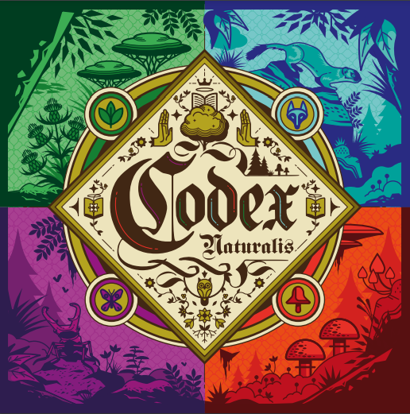

# Prova Finale di Ingegneria del Software - A.A. 2023/2024

Implementation of the board game [**Codex Naturalis**](https://www.craniocreations.it/prodotto/codex-naturalis). 
The project consists in the implementation of a single-server system capable of simultaneously managing multiple games made up of 2 to 4 clients (one for each player). 
Each player can choose to play using either the Textual User Interface (TUI) or the Graphical User Interface (GUI).

## Group members

- [__Di Carlo Andrea__](https://github.com/AndreaDiC11) - 10829826
- [__Falcone Giacomo__](https://github.com/giacomofalcone) - 10804110
- [__Foini Lorenzo__](https://github.com/LorenzoFoini) - 10828129
- [__Gallo Fabio__](https://github.com/fabiogallo01) - 10742348

## Features
We have implemented  the following advanced features:
| Feature                          | Implemented        |
|----------------------------------|--------------------|
| Simplified rules                 | :heavy_check_mark: |
| Complete rules                   | :heavy_check_mark: |
| TUI                              | :heavy_check_mark: |
| GUI                              | :heavy_check_mark: |
| Socket                           | :heavy_check_mark: |
| RMI                              | :x:                |
| AD: Multiple matches             | :heavy_check_mark: |
| AD: Persistence                  | :x:                |
| AD: Resilience to disconnections | :x:                |
| AD : Chat                        | :x:                |

AF: Advanced feature (not present in the board game).

## Coverage
| Package    |   Classes    |    Method     |     Lines     |
|------------|--------------|---------------|---------------|
| Model      |  100% (1/1)  |  100% (20/20) |  90% (80/88)  |
| Controller | 100% (29/29) | 94% (126/134) | 90% (767/846) |

## Used tools

| Library/Plugin  | Description                                      |
|-----------------|--------------------------------------------------|
| __IntelliJ__    | IDE for the Java programming language            |
| __JUnit__       | Testing framework                                |
| __Maven__       | Build automation tool                            |
| __StarUML__     | UML and sequence diagram generation tool         |

## How to run the JAR
### From IntelliJ's terminal
1. Access the package CodexNaturalis/deliverables/Final/jar
2. Right-click on Server.jar
   1 Press "Run"
3. Right click on Client.jar
   - Press "More Run/Debug"
   - Press "Modify Run Configuration..."
   - In "Programs arguments" insert:
      * X.X.X.X stands for server's IP (Default: localhost => It only works for clients launched on the same machine as the server)
      * TUI or GUI for playing with such UI (Case unsensitive, default: GUI => Start GUI if no parameter is insert)
   - Press "Apply" or "Ok"
4. Press "Run"

### From Window's terminal
1. Download Client.jar and Server.jar from package CodexNaturalis/deliverables/Final/jar
2. Open Window's terminal

For running the server:
1. Move to the same folder of the Server.jar
2. Insert: `java -jar Server.jar`

For running the client:
1. Move to the same folder of Client.jar
2. Insert: `java -jar Client.jar X.X.X.X UI`
   Where:
      - X.X.X.X stands for server's IP (Default: localhost => It only works for clients launched on the same machine as the server)
      - UI can be TUI or GUI for playing with such UI (Case unsensitive, default: GUI => Start GUI if no parameter is insert)

## License

[**Codex Naturalis**] is property of [**Cranio Creations**] and all of the copyrighted graphical assets used in this project were supplied by [**Politecnico di Milano**] in collaboration with their rights' holders.

[**Codex Naturalis**]:https://www.craniocreations.it/prodotto/codex-naturalis
[**Cranio Creations**]: https://www.craniocreations.it/
[**Politecnico di Milano**]: https://www.polimi.it/
