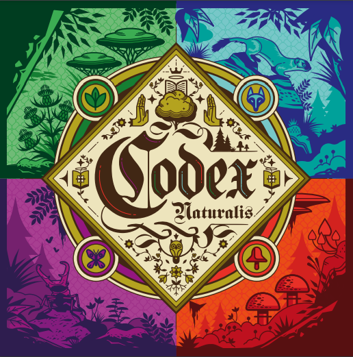

# Prova Finale di Ingegneria del Software - A.A. 2023/2024

Implementation of the board game [**Codex Naturalis**](https://www.craniocreations.it/prodotto/codex-naturalis). 
The project consists in the implementation of a single-server system capable of simultaneously managing multiple games made up of 2 to 4 clients (one for each player). 
Each player can choose to play using either the Textual User Interface (TUI) or the Graphical User Interface (GUI).

## Group members

- [__Di Carlo Andrea__](https://github.com/AndreaDiC11) - 
- [__Falcone Giacomo__](https://github.com/giacomofalcone) - 10804110
- [__Foini Lorenzo__](https://github.com/LorenzoFoini) - 10828129
- [__Gallo Fabio__](https://github.com/fabiogallo01) - 

## Features
We have implemented  the following advanced features:
| Feature                          | Implemented        |
|----------------------------------|--------------------|
| Simplified rules                 | :heavy_check_mark: |
| Complete rules                   | :heavy_check_mark: |
| TUI                              | :heavy_check_mark: |
| GUI                              | :heavy_check_mark: |
| Socket                           | :heavy_check_mark: |
| RMI                              | :x:                |
| AD: Multiple matches             | :heavy_check_mark: |
| AD: Persistence                  | :x:                |
| AD: Resilience to disconnections | :x:                |
| AD : Chat                        | :x:                |

AD: Advanced features (not present in the board game).

## Used tools

| Library/Plugin  | Description                                      |
|-----------------|--------------------------------------------------|
| __IntelliJ__    | IDE for the Java programming language            |
| __JUnit__       | Testing framework                                |
| __Maven__       | Build automation tool                            |
| __StarUML__     | UML generation tool                              |

## How to run the JAR

## License

[**Codex Naturalis**] is property of [**Cranio Creations**] and all of the copyrighted graphical assets used in this project were supplied by [**Politecnico di Milano**] in collaboration with their rights' holders.

[**Codex Naturalis**]:https://www.craniocreations.it/prodotto/codex-naturalis
[**Cranio Creations**]: https://www.craniocreations.it/
[**Politecnico di Milano**]: https://www.polimi.it/
